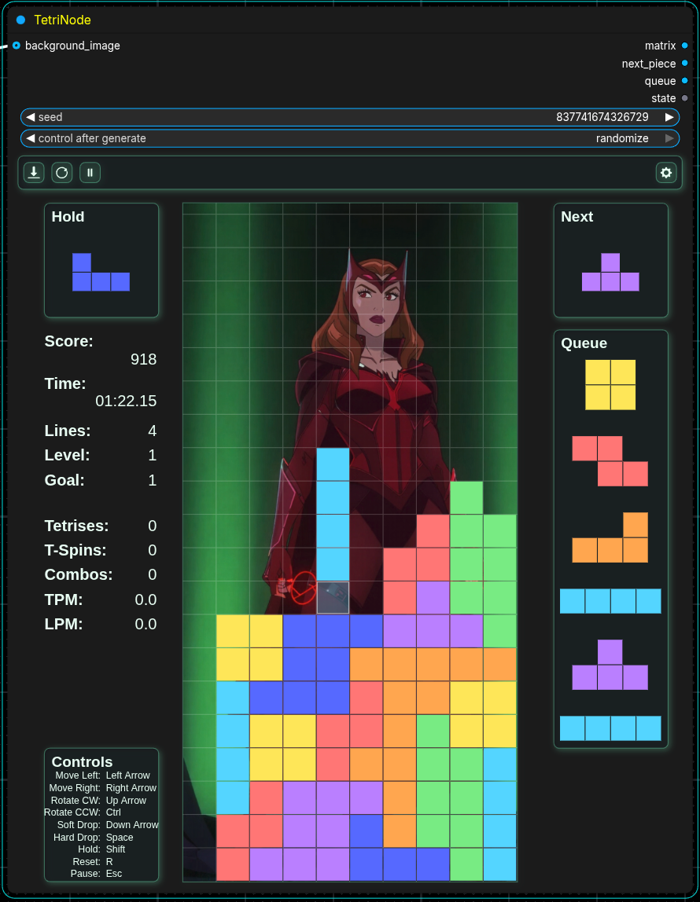
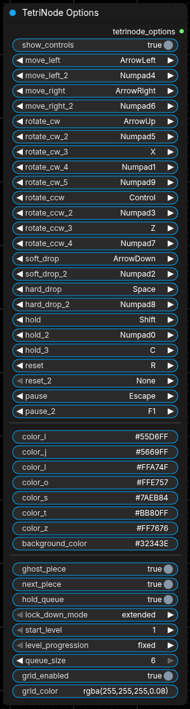

# TetriNode

A ComfyUI custom node pack that embeds a playable Tetris game inside a node UI, with image outputs for the live board and next-piece preview.

## Features

- Live, playable Tetris inside the node UI
- Board image output and next-piece image output
- Score + lines-cleared tracking (not fully functional yet; current functionality is score = lines cleared)
- Pause/Play and Reset controls
- Seeded piece generation with a standard seed widget available
- Optional keybinding configuration via `TetriNode Options` node

## Nodes

### TetriNode

Main gameplay node.

**Inputs**
- `tetrinode_options` (TETRINODE_OPTIONS): Custom keybindings for moving left/right, rotating the piece, dropping the piece, play/pause, and reset
- `seed` (INT): Seed used for piece sequence

**Outputs**
- `image` (IMAGE): current board
- `state` (STRING): serialized game state
- `lines_cleared` (INT)
- `score` (INT)
- `next_piece` (IMAGE): preview image

### TetriNode Options

Optional node that provides keybindings.

**Outputs**

- `tetrinode_options` (TETRINODE_OPTIONS): Custom keybindings for moving left/right, rotating the piece, dropping the piece, play/pause, and reset

## Controls (Default)

Displayed inside the node UI and reflected in the game input handler.

- Move Left: `A`
- Move Right: `D`
- Rotate: `W`
- Drop: `S`
- Reset: `R`
- Pause: `P`

## Installation

### Installation (preferred)

Install via ComfyUI Manager or the ComfyUI Registry once operational. (I will update the documentation once that is ready to go.)

### Installation (alternative)

1. Copy this repository into `ComfyUI/custom_nodes/TetriNode/`.
2. Restart ComfyUI.
3. Add `TetriNode` and (optionally) `TetriNode Options` from the node list.

## License

MIT
