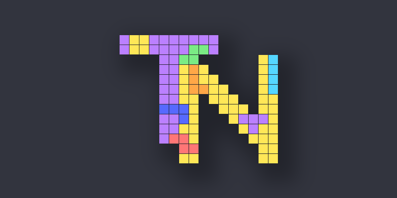

# TetriNode

  

A ComfyUI custom node pack that embeds a playable Tetris game inside a node UI, with image outputs for the live board and next-piece preview.

## Features

- Live, playable Tetris inside the node UI
- Board image output and next-piece image output
- Guideline-based scoring (lines, T-Spins, drops, and back-to-back bonuses)
- Level progression with guideline fall speeds
- Pause/Play and Reset controls
- Seeded piece generation with a standard seed widget available
- Optional keybinding configuration via `TetriNode Options` node

## Nodes

### TetriNode

Main gameplay node.

**Inputs**
- `tetrinode_options` (TETRINODE_OPTIONS): Custom keybindings for moving left/right, rotating the piece, soft/hard drop, play/pause, and reset
- `seed` (INT): Seed used for piece sequence
- `background_image` (IMAGE, optional): Background image for the game board (scaled to cover, then center-cropped)

**Outputs**
- `image` (IMAGE): current board
- `state` (STRING): serialized game state
- `score` (INT)
- `lines_cleared` (FLOAT): total or awarded line clears (variable goal system)
- `goal` (FLOAT): lines needed to reach the next level
- `next_piece` (IMAGE): preview image

### TetriNode Options

Optional node that provides keybindings.

**Inputs**

- `move_left`, `move_right`, `rotate_cw`, `rotate_ccw`, `soft_drop`, `hard_drop`, `reset`, `pause`: Primary key bindings (dropdowns)
- `move_left_2`, `move_right_2`, `rotate_cw_2`, `rotate_ccw_2`, `soft_drop_2`, `hard_drop_2`, `reset_2`, `pause_2`: Secondary key bindings (optional)
- `color_i`, `color_j`, `color_l`, `color_o`, `color_s`, `color_t`, `color_z`: Hex colors for each tetromino (e.g. `#55D6FF`)
- `background_color`: Hex color for the board background (ignored when a background image is connected)
- `ghost_piece`: Toggle for the ghost piece (default: on)
- `lock_down_mode`: Lock down behavior (`extended`, `infinite`, `classic`, default: `extended`)
- `start_level`: Starting level (1-15, default: 1)
- `level_progression`: Level goal system (`fixed` or `variable`, default: `fixed`)
- `queue_size`: Number of queue pieces to display (0-6, default: 6)

**Outputs**

- `tetrinode_options` (TETRINODE_OPTIONS): Custom keybindings, colors, and gameplay options

## Controls (Default)

Displayed inside the node UI and reflected in the game input handler.

- Move Left: `A`
- Move Right: `D`
- Rotate CW: `W`
- Rotate CCW: `Q`
- Soft Drop: `S`
- Hard Drop: `Space`
- Reset: `R`
- Pause: `P`

## Scoring

Scoring follows the 2009 Tetris Design Guideline.

**Line clears (× Level)**
- Single: 100
- Double: 300
- Triple: 500
- Tetris: 800

**T-Spins (× Level)**
- T-Spin: 400
- T-Spin Single: 800
- T-Spin Double: 1200
- T-Spin Triple: 1600

**Mini T-Spins (× Level)**
- Mini T-Spin: 100
- Mini T-Spin Single: 200

**Drops**
- Soft Drop: +1 per row
- Hard Drop: +2 per row

**Back-to-Back**
- 0.5× bonus for consecutive Tetrises, T-Spin line clears, and Mini T-Spin line clears
- Non-line T-Spins/Mini T-Spins do not start a B2B chain and do not break an existing chain
- Singles/Doubles/Triples break a B2B chain

**Variable goal line awards**
- When `level_progression` is `variable`, the Lines Cleared counter uses awarded line clears per action.
- Awarded lines: Single/Mini T-Spin = 1, Mini T-Spin Single = 2, Double = 3, Triple = 5, T-Spin = 4, Tetris/T-Spin Single = 8, T-Spin Double = 12, T-Spin Triple = 16
- Back-to-Back adds +0.5× awarded line clears

## Leveling

Levels are capped at 15 and drive normal fall speed.

**Fixed goal system (default)**
- Level increases every 10 lines cleared

**Variable goal system**
- Level 1: 5 lines
- Level 2: 10 lines
- Level 3: 15 lines
- …adding 5 more lines per level up to 15

**Fall speed formula**
- `(0.8 - ((level - 1) * 0.007))^(level - 1)` seconds per line
- Soft Drop is 20× faster than the current fall speed

**Fall speed (approx., seconds per line)**
- Level 1: 1.000
- Level 2: 0.793
- Level 3: 0.618
- Level 4: 0.473
- Level 5: 0.355
- Level 6: 0.262
- Level 7: 0.190
- Level 8: 0.135
- Level 9: 0.094
- Level 10: 0.064
- Level 11: 0.043
- Level 12: 0.028
- Level 13: 0.018
- Level 14: 0.011
- Level 15: 0.007
## Installation

### Installation (preferred)

Install via ComfyUI Manager. Search for "TetriNode" and click install.
The node pack is also available on the Comfy Registry site by [clicking here](https://registry.comfy.org/publishers/soulctcher/nodes/TetriNode).

### Installation (alternative)

1. Copy this repository into `ComfyUI/custom_nodes/TetriNode/`.
2. Restart ComfyUI.
3. Add `TetriNode` and (optionally) `TetriNode Options` from the node list.

## License

MIT
