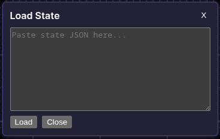
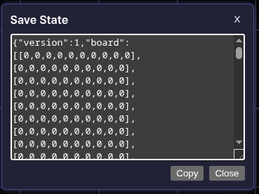
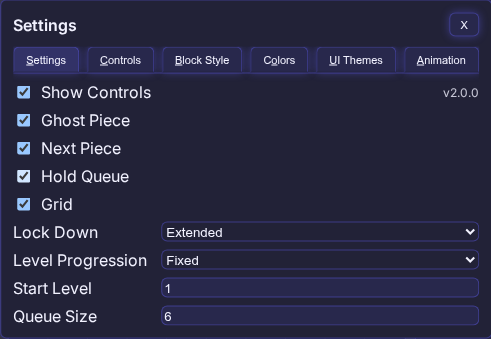
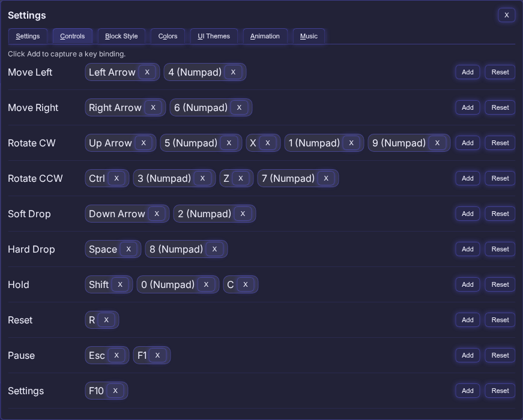
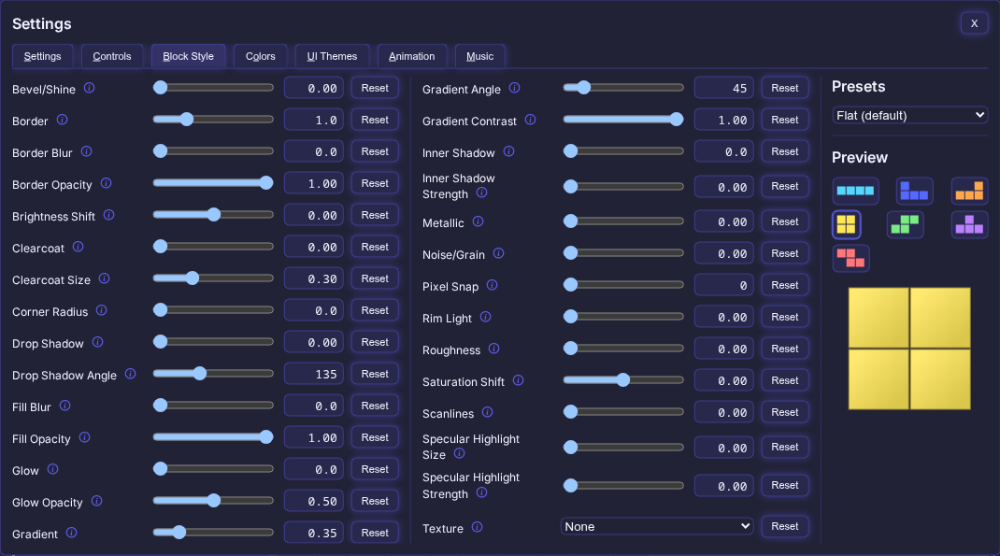
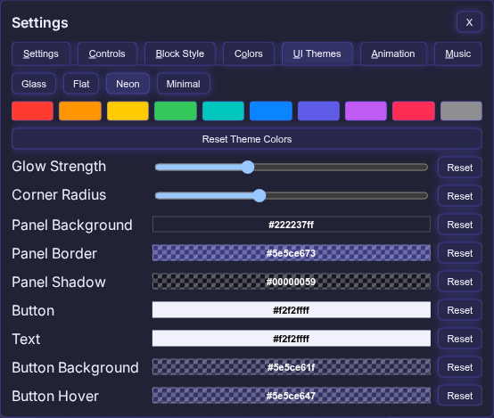
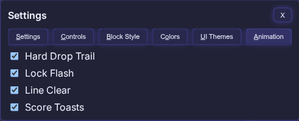
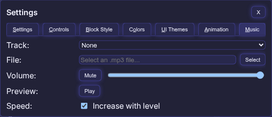

# TetriNode

  

A ComfyUI custom node pack that embeds a playable Tetris game inside a node UI, with an image output for the live board.

## Features

- Live, playable Tetris inside the node UI
- Matrix image output for the live board
- Hold, next piece, and queue panels inside the node UI
- Optional background image (scaled to cover, center-cropped)
- Optional ghost piece and playfield grid
- Official Tetris Guideline-based scoring (lines, T-Spins, drops, and back-to-back bonuses)
- Level progression with official fall speeds
- Pause/Play, Reset, Load State, and Save State controls
- Seeded piece generation with a standard seed widget available
- In-node toolbar with a single Settings screen (tabs: Settings, Controls, Block Style, Colors, UI Themes, Animation, Music)
- Built-in music player with 6 loopable tracks, custom MP3 support, volume/mute, and level-based speed increase
- Block Style presets with extensive style sliders and per-slider reset
- Optional block textures (Pixel Art, Brushed Metal, Wooden Block, Concrete, Toxic Slime)
- Randomized texture sampling per block for supported textures
- Animation effects (lock flash sweep, line clear, hard drop trail, score toasts)

## Nodes

### TetriNode

Main gameplay node.

**Inputs**
- `seed` (INT): Seed used for piece sequence
- `background_image` (IMAGE, optional): Background image for the game board (scaled to cover, then center-cropped)

**Outputs**
- `matrix` (IMAGE): current board

**UI controls**
- **Top toolbar**: Load State, Save State, Reset, Pause/Play, Music volume/mute, and a Settings screen.
- **Load State**: Opens a screen to paste a serialized state.

- **Save State**: Opens a screen with the current state JSON for copy/paste.

### Settings screen

All configuration now lives inside TetriNode (no external options node). The Settings screen is tabbed.

- **Settings**: Toggles (controls/ghost/next/hold/grid), lock-down mode, level progression, start level, and queue size.

- **Controls**: Click Add to capture a key (up to 5 per action). Remove any binding with the `X`, or reset per action. Capture supports the same allowed keys as before and shows human-friendly labels.

- **Block Style**: Presets plus detailed style sliders (border, bevel, gradients, glow, shadows, etc.) with per-slider reset.

- **Colors**: Per-piece colors plus background and grid colors. Presets dropdown includes multiple palettes; tetromino colors use 6‑digit hex; grid supports alpha.

- **UI Themes**: Glass/Flat/Neon/Minimal presets with editable colors and a “Reset Theme Colors” button.

- **Animation**: Toggles for Hard Drop Trail, Lock Flash, Line Clear, and Score Toasts. Disabling Line Clear or Lock Flash removes their timing delays.

- **Music**: Built-in Game Boy and NES tracks, custom MP3 selector, volume/mute, preview button, and a toggle for progressive speed increase.

## Controls (Default)

Displayed inside the node UI and reflected in the game input handler.

- Move Left: `ArrowLeft` / `Numpad4`
- Move Right: `ArrowRight` / `Numpad6`
- Rotate CW: `ArrowUp` / `Numpad5` / `X` / `Numpad1` / `Numpad9`
- Rotate CCW: `Ctrl` / `Numpad3` / `Z` / `Numpad7`
- Soft Drop: `ArrowDown` / `Numpad2`
- Hard Drop: `Space` / `Numpad8`
- Hold: `Shift` / `Numpad0` / `C`
- Reset: `R`
- Pause: `Esc` / `F1`

## Scoring

Scoring follows the Official 2009 Tetris Design Guideline.

**Line clears (× Level)**
- Single: 100
- Double: 300
- Triple: 500
- Tetris: 800

**T-Spins (× Level)**
- T-Spin: 400
- T-Spin Single: 800
- T-Spin Double: 1200
- T-Spin Triple: 1600

**Mini T-Spins (× Level)**
- Mini T-Spin: 100
- Mini T-Spin Single: 200

**Drops**
- Soft Drop: +1 per row
- Hard Drop: +2 per row

**Back-to-Back**
- 0.5× bonus for consecutive Tetrises, T-Spin line clears, and Mini T-Spin line clears
- Non-line T-Spins/Mini T-Spins do not start a B2B chain and do not break an existing chain
- Singles/Doubles/Triples break a B2B chain

**Variable goal line awards**
- When `level_progression` is `variable`, the Lines Cleared counter uses awarded line clears per action.
- Awarded lines: Single/Mini T-Spin = 1, Mini T-Spin Single = 2, Double = 3, Triple = 5, T-Spin = 4, Tetris/T-Spin Single = 8, T-Spin Double = 12, T-Spin Triple = 16
- Back-to-Back adds +0.5× awarded line clears

## Leveling

Levels are capped at 15 and drive normal fall speed.

**Fixed goal system (default)**
- Level increases every 10 lines cleared

**Variable goal system**
- Level 1: 5 lines
- Level 2: 10 lines
- Level 3: 15 lines
- …adding 5 more lines per level up to 15

**Fall speed formula**
- `(0.8 - ((level - 1) * 0.007))^(level - 1)` seconds per line
- Soft Drop is 20× faster than the current fall speed

**Fall speed (approx., seconds per line)**
- Level 1: 1.000
- Level 2: 0.793
- Level 3: 0.618
- Level 4: 0.473
- Level 5: 0.355
- Level 6: 0.262
- Level 7: 0.190
- Level 8: 0.135
- Level 9: 0.094
- Level 10: 0.064
- Level 11: 0.043
- Level 12: 0.028
- Level 13: 0.018
- Level 14: 0.011
- Level 15: 0.007

## Developer Structure

The runtime behavior is unchanged, but the codebase has been split for easier navigation:

- `tetris_node.py` now acts as a compatibility export wrapper.
- Python internals are organized under `tetrinode/` by concern (`assets`, `state`, `game`, `render`, `node_api`).
- JS gameplay entry remains `js/tetris_live.js`, with extracted modules under `js/live/` (`constants`, `data`, `core`, `render`, `ui`, `config`, `input`, `bridge`).
- Refactor architecture and module map are documented in `docs/refactor_architecture.md`.
- Behavior and interface parity checks live in `qa/parity/`.

## Installation

### Installation (preferred)

Install via ComfyUI Manager. Search for "TetriNode" and click install.
The node pack is also available on the Comfy Registry site by [clicking here](https://registry.comfy.org/publishers/soulctcher/nodes/TetriNode).

### Installation (alternative)

1. Copy this repository into `ComfyUI/custom_nodes/TetriNode/`.
2. Restart ComfyUI.
3. Add `TetriNode` from the node list.

## License

MIT
